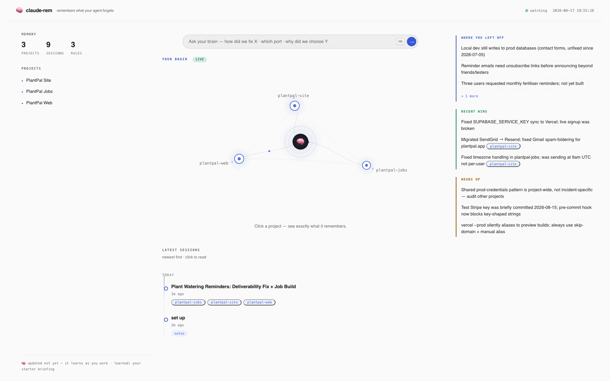

<h1 align="center">
  <br>
  🧠
  <br>
  claude-rem
  <br>
</h1>

<h4 align="center">A brain that remembers everything. One memory for all your AI coding tools.</h4>

<p align="center">
  <a href="https://www.npmjs.com/package/claude-rem">
    
  </a>
  <a href="LICENSE">
    
  </a>
  <a href="#requirements">
    
  </a>
  <a href="#faq">
    
  </a>
</p>

<p align="center">
  <a href="https://claude.com/claude-code"></a>
  <a href="https://cursor.com"></a>
  <a href="https://github.com/openai/codex"></a>
</p>

<p align="center">
  <a href="#quick-start">Quick Start</a> •
  <a href="#works-with">Works With</a> •
  <a href="#what-it-looks-like">What It Looks Like</a> •
  <a href="#how-it-works">How It Works</a> •
  <a href="#commands">Commands</a> •
  <a href="#faq">FAQ</a> •
  <a href="#license">License</a>
</p>

<p align="center">
  claude-rem reads each session after it ends, distills what mattered into a
  briefing of your workspace, verifies it against your repos, and hands it to
  your agent the moment the next session starts. Tell it something once,
  anywhere; every tool remembers it.
</p>

---

**One brain, every tool.** Your transcripts are the richest record of your
work that exists, and today they evaporate when the session ends. Claude
Code, Cursor, and Codex all feed and read the same store, so that record
works for you, not for any one platform. No vendor will compile a
competitor's transcripts for you.

**Evidence over claims.** Agents confidently report things that didn't
happen, so everything is checked against your repos before it becomes
memory. If the session says "built the API" and git disagrees, the brain
believes git. Every fact traces back to a session digest and a commit.

**Why "rem"?** REM sleep is when a brain consolidates the day into long-term
memory. Same job here: replay the session, verify it, consolidate what
mattered, brief the next one.

---



## Quick Start

```bash
cd ~/your-workspace        # the directory you open your coding agent in
npx claude-rem init
```

Or from the plugin marketplace inside Claude Code:

```bash
/plugin marketplace add jatingargiitk/claude-rem
/plugin install claude-rem
```

Init scans your past sessions (with your consent) and compiles a real
starting brain, so it remembers your history from day one:

```
Brain compiled: 43 session digest(s), 14 project note(s) in 434s.
```

A few minutes, once per workspace, ever. It runs on the Claude subscription
you already pay for and prints its own cost receipt. From then on everything
is automatic.

**Key Features:**

- 🎯 **Relevance-gated injection**: full briefing on the first prompt; after
  that, only the note your prompt is about, or silence
- 🧠 **Compiled, not appended**: every harvest rewrites a ~100-line STATE of
  what's true right now; the store gets cleaner as it grows
- 🔁 **Corrections that stick**: correct it once and it becomes a rule every
  future session obeys, in every tool
- 📊 **Self-measuring**: `ab` and `eval` run blind brain-vs-no-brain
  comparisons with an impartial judge
- 📁 **Plain files + git**: markdown you can read and diff; one commit per
  harvest, anything wrong is one revert away
- 🔒 **Local and private**: no server, no telemetry, no API key;
  `<private>...</private>` never reaches a model
- 🪶 **No daemon, no vector DB, no heavy deps**: hooks fire, do their job,
  exit; atomic writes under one shared lock

---

## Works With

| Tool | Reads the brain | Feeds the brain |
|---|---|---|
| **[Claude Code](https://claude.com/claude-code)** | session-start + per-prompt injection hooks | Stop-hook harvest |
| **[Cursor](https://cursor.com)** | session-start + per-prompt injection hooks | stop-hook harvest (`cursor-agent` engine fallback) |
| **[Codex CLI](https://github.com/openai/codex)** | managed block in `AGENTS.md` (markers only) | `notify`-hook harvest |

```bash
npx claude-rem init --cursor --codex
```

---

## What It Looks Like

The first prompt of a session gets the full briefing, with a receipt naming
exactly what was injected:

```
🧠 brain → STATE.md · 14 projects indexed (harvest 33m ago)
```

Later prompts only get the note they're about, or nothing:

```
🧠 brain → tiny-api
```

Behind the receipt sits STATE.md. Real output, compiled from real sessions
on a two-service workspace:

```markdown
## Active projects
- **webhook-relay** (`relay.py`): verifies Stripe HMAC-SHA256 signatures
  (constant-time compare), forwards to an internal queue, retries
  1s/2s/4s/8s/16s then dead-letters. Queue changed from unbounded to
  bounded (maxsize 1000) with HTTP 429 backpressure on 2026-08-12,
  root-caused as the fix for a same-day incident where a traffic spike
  OOM-killed the process and dropped in-flight events.
- **tiny-api** (`app.py`): Flask items API confirmed working both from
  shell and under launchd, on port 5057. DB path changed from relative to
  absolute, which resolved 500s that occurred only under launchd.

## Conventions
- webhook-relay: payload bodies are never logged (may contain customer
  PII) — only event ID + status, per explicit user instruction.
- tiny-api: port 5057 instead of 5000 — macOS AirPlay Receiver occupies
  5000, causing "address already in use".

## Open threads
- Cross-project gotcha: launchd-run processes do not share the shell's
  working directory. This caused the tiny-api DB bug; webhook-relay has
  NOT yet been audited for the same relative-path assumption.
- Cross-project gotcha: an unbounded internal queue is a silent OOM risk
  that surfaces only under load. This caused the webhook-relay incident;
  other queues have not been checked for the same pattern.
```

Three things worth noticing. The PII rule exists because the user said it
once, mid-session. The incident entry keeps root cause and fix rationale
together, not just the final code state. And the cross-project gotchas are
what grep can never give you: the brain generalized each incident into a
pattern and flagged the *other* service as unaudited for it. That is the
difference between storing your history and remembering it.

### The dashboard

```bash
npx claude-rem ui
```

A local dashboard (127.0.0.1 only, no daemon; it runs while you look at it):

- **Your brain, live**: an interactive map of your projects. Node size
  tracks how much it knows; amber halos mark what the briefing is worried
  about. Click any project to see exactly what it remembers, its loose
  ends, and the sessions behind it.
- **Where you left off / Recent wins / Heads up**: a model-written briefing
  of your workspace, rewritten after every save.
- **Ask your brain**: ranked search over everything it knows, with a ⌘K
  command palette.
- **Latest sessions**: every session digest on a timeline, click to read.
- The topbar tells the truth: green `watching · saved 4m ago` while hooks
  are live, amber `stale` when nothing has been saved for a day.

---

## It Measures Itself

```bash
npx claude-rem ab "why is the deploy failing?"   # one question, blind vs brain
npx claude-rem eval                              # your whole question set, judged blind
```

`eval` answers every question twice, brain injected vs brain physically
hidden from disk, then a third model grades both blind, order randomized.
Honest results from my own workspace: the brain wins decisively on
debugging-with-history and architecture, loses some status questions to an
agent that just reads the code, and every failure found became a fix. As far
as I know it's the only memory system that ships its own falsification
harness.

---

## How It Works

```
session ends ──► condense transcript (no LLM, <private> stripped)
             ──► evidence snapshot (git status of your repos)
             ──► ONE model call: returns digest + topic + STATE as text
             ──► claude-rem applies the files itself (atomic, path-jailed)
             ──► git commit
session starts ─► receipt + briefing injected; later prompts get
                  relevance-matched project notes, or silence
```

The model never touches your disk. One single-turn call per debounced
session-end (~40KB of new transcript), in the background, never blocking
you. The brain lives at `<workspace>/.claude-rem/`:

```
STATE.md          # the ~100-line briefing, injected at session start
topics/<slug>.md  # rolling per-project detail, rewritten in place
sessions/         # immutable session digests (raw history)
RULES.md          # learned conventions, promoted from your corrections
evals.json        # your blind-eval question set
.git/             # one commit per harvest
```

Most memory tools are diaries: append forever, search the pile, recall
degrades as it grows. That is storage, not remembering. claude-rem rewrites
its briefing in place, the same consolidation bet OpenAI, Anthropic, and
Google all made this year. A bigger pile is not a better memory.

---

## Commands

You only ever need the first one.

```
npx claude-rem init        # scan history, compile the starting brain, install hooks
npx claude-rem ui          # open the local dashboard
npx claude-rem status      # is it alive, what does it hold, last commits
npx claude-rem search <w>  # ranked search over everything it knows
npx claude-rem log         # what it learned, when
npx claude-rem harvest     # force a harvest right now
npx claude-rem ab "<q>"    # one question: blind vs brain, side by side
npx claude-rem eval        # the whole question set, blind-judged
npx claude-rem uninstall   # removes hooks; your brain files stay put
```

---

## Documentation

- **[Installation](docs/installation.md)**: quick start, flags, marketplace install, uninstall
- **[How It Works](docs/how-it-works.md)**: the harvest loop, the three memory layers, injection
- **[Architecture](docs/architecture.md)**: per-tool hooks, harvest engines, corruption resistance
- **[Configuration](docs/configuration.md)**: `config.json` keys, env vars, the rules layer
- **[Evaluation](docs/evaluation.md)**: the blind ab/eval harness
- **[Privacy](docs/privacy.md)**: what stays local (everything), what leaves (one distill call)
- **[Troubleshooting](docs/troubleshooting.md)**: health checks, failure modes, starting over

---

## FAQ

**What does it cost?**
Nothing beyond the Claude subscription you already pay for. No API key, no
separate billing. The starting compile prints its own receipt; after that
it's one small single-turn call per session-end, always on the best model
the host offers (a cheap model writes confident wrong facts into memory that
every later session inherits — pin `model` in config if you disagree).

**Does my code leave my machine?**
Only to your own Claude subscription for the distill call, which is where
your sessions already go. No server of mine, no telemetry, no uploads.

**Does it work in claude.ai web / cloud sessions?**
No, by design it's local. Every local surface works (terminal, VS Code /
JetBrains, desktop app, Cursor, Codex CLI); cloud sandboxes can't reach
your disk. Your memory stays on your machine; that's the trade.

**What if a harvest writes something wrong?**
Every harvest is a git commit. Revert it.

**I use Cursor but not Claude Code, does it work?**
Yes. Harvesting falls back to Cursor's `cursor-agent` CLI when `claude`
isn't installed, so a Cursor-only machine gets the full loop.

---

## Requirements

macOS or Linux · Node ≥ 18 · python3 · git · the
[Claude Code](https://claude.com/claude-code) CLI logged in to your
subscription (or `cursor-agent` on Cursor-only machines).

## Roadmap

More transcript readers (Gemini CLI and friends) · MCP server so non-hooked
tools can pull from the brain · Windows.

## Status

v0.2.x, young and moving fast. I run it daily across a 40-project
workspace; it's how this README knows what it's talking about. Issues and
war stories welcome.

## License

Apache-2.0
